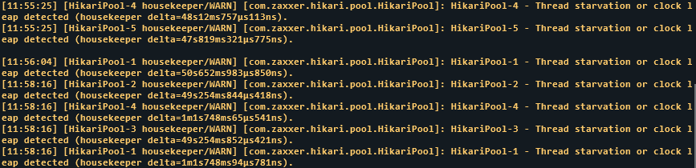
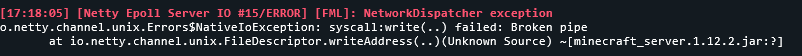

 # DeadLockDetector [or DLD]
## What is DeadLockDetector and how does it work?
DeadLockDetector is supposed to detect a frozen server, and automatically restart it.
There are two parts of this system:
1. The Plugin sends a Heartbeat-Message to the `ServerWatcher` on every tick that passes on the server.
2. The Plugin starts a separate Java Process. 
That Process is called the `ServerWatcher`.
It is responsible for actually detecting a stalled/frozen/Deadlocked server, by comparing the time between Heartbeat-Messages.

## Why do you use a Separate Process?

Anything less has proven for us to not work reliably.
There are many ways a server can not tick anymore (or appear to be doing so).
In some cases it is impossible to get my plugin to work, so I created an independent process.

1. There is a TON of lag currently on the server (e.g. tons of items), and a single tick just takes a long time.
2. The Thread/Task scheduler of the Server just stops executing the ServerThread. 
3. The Server just magically has a Socket reset error, and then no ticks pass anymore. 
4. The Server stops, but isn't recognised as having stopped for some reason. (this also happened to us, but the plugin wasn't installed at the server at that time).

## Can I use the Plugin?

If you use [Pterodactyl](https://pterodactyl.io/) as your Server Panel, yes!
To get started check out [the config at](deadlockdetector-plugin/src/main/resources/config.yml).
For a new Installation you will want to change the following things (in order of importance):
1. `url` and `key`. They give the Plugin authorisation to actually restart the server.
2. `timeout`. This sets how many seconds must pass without any ticks, before the plugin sends a Restart action to Pterodactyl.
3. `restartWait`. How many seconds must pass after `timeout`, before the KIll action is sent to Pterodactyl.

### I use panel XY for managing my Servers. Can you add support

This will require investigation for every panel.
Generally, I need to be able to Restart and Kill servers from an api.
If you cannot Restart and Kill servers, I cannot support your panel.

If you want support and are willing to give me a test account and instance, feel free to create a new issue.
Please include your Discord Username in your Message, as I might contact you for a test account if I determine it potentially possible to implement.
(If you disabled direct DM's and we do not share any common servers, join [https://discord.gg/E54xzKhu6s](https://discord.gg/E54xzKhu6s) and allow DM's for that server, so I can message you.)
Just because I messaged you however, does not mean that support for that panel is guaranteed.
Every Panel and API is different, and there may be unexpected complications.

## I have found a bug

Sorry to hear, that this Code still has bugs.
Feel free to create an Issue, with details on what the bug is, how to reproduce it, what version you are using (if applicable), what happened as a result of the bug, and what you expected instead.

## Contributing Information

As this Project does not have an official Licence, it is considered as All Rights Reserved (from what I know).
To counteract any possible issues over Code Ownership, you agree to transfer ownership of your Code to the owner of this Repository.
This ensures that we can actually set a License, when we have decided on one (because otherwise we need approval from everyone that has committed their code to this repository).

## Informal License

1. You may not redistribute the code in any way, shape or form, altered or not! GitHub Forks with the intent of making a Pull-Request are excluded from this rule.
2. This includes using this project's code as a base for your new Project.
3. Making bugfixes is still acceptable and even welcome, as long as you either do not publicly redistribute the code as stated in 1. and 2. or make a Pull-Request to this repository.
4. Using any compiled .jar files from this repository is allowed.

I know this is not a standard licence, but I have a hard time deciding on one.
For now, I basically want to deter people from ripping off my project.
The key takeaway from here should be, that you still can help this Plugin or Repository grow by contributing to its code, sharing its link, using the jars provided here and sharing the links to jars provided here.